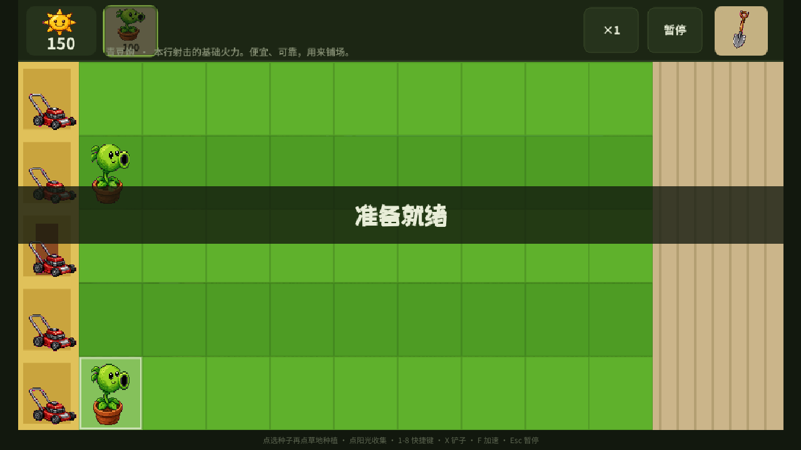

# 阳光防线 Sunline Defense

像素风花园塔防。种植十二种植物，挡住十二关行尸。白天攒阳光、夜间靠蘑菇，通关解锁图鉴。

> Fan-made tribute inspired by *Plants vs. Zombies*. Not affiliated with EA / PopCap.

**[在线游玩 Play in browser](https://xinian5216.github.io/sunline-defense/)** ·
**[下载 APK / 桌面版 Releases](https://github.com/xinian5216/sunline-defense/releases/latest)**


## 怎么玩

| 方式 | 适合谁 | 做什么 |
| --- | --- | --- |
| **网页** | 所有人 | 打开 [GitHub Pages](https://xinian5216.github.io/sunline-defense/) ，手机请**横屏** |
| **安卓 APK** | 安卓手机 | [Releases](https://github.com/xinian5216/sunline-defense/releases/latest) 下载 `SunlineDefense-*.apk`，允许「未知来源」后安装。游戏会锁横屏 |
| **iPhone / iPad** | 苹果手机 | 用 Safari 打开网页 → 分享 → **添加到主屏幕**（苹果不让随便装 IPA） |
| **Windows 绿色版** | 不想装环境 | 下载 `SunlineDefense-Portable-*.exe`，双击即玩 |
| **Windows 安装包** | 想要开始菜单快捷方式 | 下载 `SunlineDefense-Setup-*.exe` |
| **macOS** | Mac 用户 | 下载 `SunlineDefense-macOS-*.dmg`。若提示损坏：右键打开，或 `xattr -cr /Applications/阳光防线.app` |
| **Linux** | 桌面 Linux | 下载 `.AppImage`，`chmod +x` 后运行 |
| **离线网页包** | 有 Python / 浏览器 | `SunlineDefense-web.zip`，解压后看说明 |
| **源码运行** | 开发者 | 见下方 |

安卓第一次打开 APK 可能被 Play 保护拦截，选「仍要安装」即可。这是爱好者签名，不是应用商店包。

## 操作

- 点选顶部种子，再点草地种植
- 点掉落 / 产出的阳光才能收集
- 铲子铲除植物（快捷键 `X` / `S`）
- `1`–`8` 选择对应种子栏
- `F` 加速（1x / 2x）
- `Esc` 暂停
- 左端割草机可挡一次破线

进度存在浏览器 / 客户端本地（localStorage），清站点数据会丢档。

## 内容

- **12 关冒险**：阳光前院（白天）→ 月光后院（夜间，天上不再掉阳光）
- **生存模式**：无限波次
- **12 种植物**：日轮花、青豆炮、木盾果、爆炎果、埋爆薯、霜冻炮、连发炮、炎爆椒、雾喷菇、曦光菇、毒雾菇、怯战菇
- **8 种行尸**：园丁尸、路障尸、铁桶尸、旗手尸、读报尸、橄榄尸、撑杆尸、铁门尸
- 割草机、旗帜大波、图鉴、本地存档



## 从源码运行

需要 [Node.js 20+](https://nodejs.org)（推荐 22 LTS）。

```bash
git clone https://github.com/xinian5216/sunline-defense.git
cd sunline-defense
npm install
npm run dev
```

浏览器打开终端提示的地址（默认 http://localhost:5173 ）。

```bash
npm run build      # 产出 dist/ 静态站点
npm run preview    # 预览构建结果
```

本地打桌面包（可选，体积较大，会临时安装 Electron）：

```bash
npm install -D electron electron-builder
npm run desktop
```

产物在 `release/`。日常开发不需要安装 Electron。

本地打安卓包（需要 JDK 21 + Android SDK）：

```bash
npm install -D @capacitor/core @capacitor/cli @capacitor/android
npm run build
npx cap add android
npx cap sync android
python3 scripts/build-apk.py
```

产物是 `SunlineDefense-<version>.apk`。

## 技术

纯前端：React 19 + Vite + Tailwind v4 + Canvas 2D。没有服务器、没有账号。音效用 Web Audio 合成。安卓包用 Capacitor 把同一套网页封进系统 WebView。

| 目录 | 作用 |
| --- | --- |
| `src/game/sim.ts` | 60Hz 模拟：种植、射击、吃植物、胜负 |
| `src/game/render.ts` | 草坪、实体、HUD |
| `src/game/catalog.ts` | 植物 / 行尸 / 关卡波次 |
| `src/game/engine.ts` | 输入、主循环 |
| `public/sprites/` | 像素素材 |

## 声明

本项目是爱好者向塔防，机制向经典花园保卫战致敬，名称、数值与像素图均为原创。*Plants vs. Zombies* 是 EA / PopCap 的商标。请支持正版。

## 许可

[MIT](LICENSE)

欢迎提 Issue / PR。贡献说明见 [CONTRIBUTING.md](CONTRIBUTING.md)。
